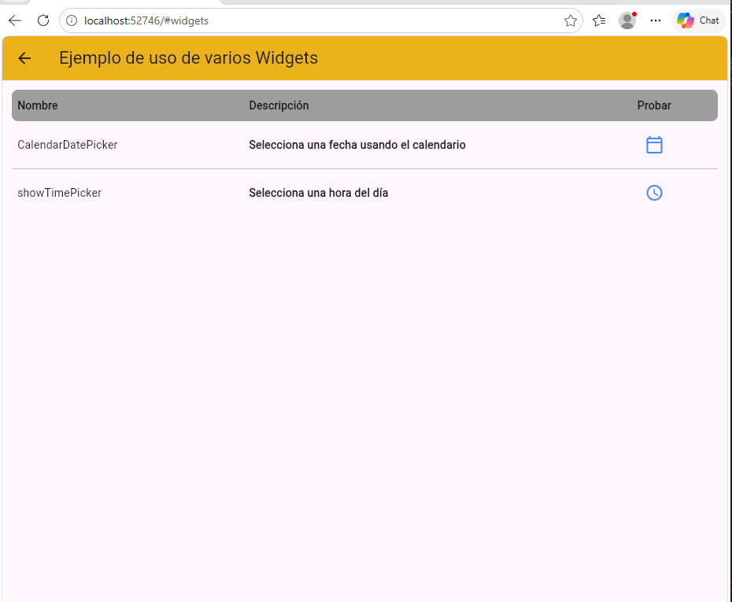

# components_application

A new Flutter project.

## Getting Started

Se construyó una tabla que lista distintos widgets y muestra cómo funciona
- Se creó un modelo WidgetComponent para determinar sus atributos
- En el screen se lista el nombre y una breve descripcion de cada widget en formato de tabla
- Al presionar el boton de cada widget, se despliega un contenedor para poder probarlo
